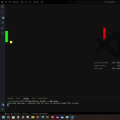

# winart

A window manipulation engine which treats native popup windows API as individual pixels to change their state in real time like typical pixels to create animations, games and desktop utilities or companions(future scope). 




## core idea
we are basically playing with the win32 API in Windows which is meant for the Desktop Window Manager. Rather than drawing pixels to a canvas, winart manages a pool of borderless windows. Using high-frequency batch updates via DeferWindowPos, the engine moves and resizes these native objects to simulate a display buffer. This creates a unique aesthetic where the operating system's own UI elements become the sprites and particles for various applications.

## setup and usage

### compilation

build your own engine dll for the engine using the `build.bat` script or use the existing one in `bin/`. 

For your own DLL build, ensure that your system has 64 bit mingw or alternative which can build the file in 64 bits for compatiblity with the python wrapper. 

```cmd
build.bat

or 

g++ -shared -o bin/engine.dll src/engine/exports.cpp -I ./src/include -static-libgcc -static-libstdc++ -m64 -luser32 -lgdi32 
```

### run 
python handles the logic layer for animations, physics and image processing.

```powershell
python -m demo.pong

python -m demo.clock
```

## contributing

Contributions, issues and feature requests are welcome.
Feel free to check issues page if you want to contribute.
Check the contributing guide.


## show your support

Please ⭐️ this repository if this project helped you!
This project is MIT licensed.